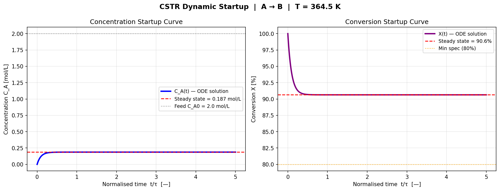
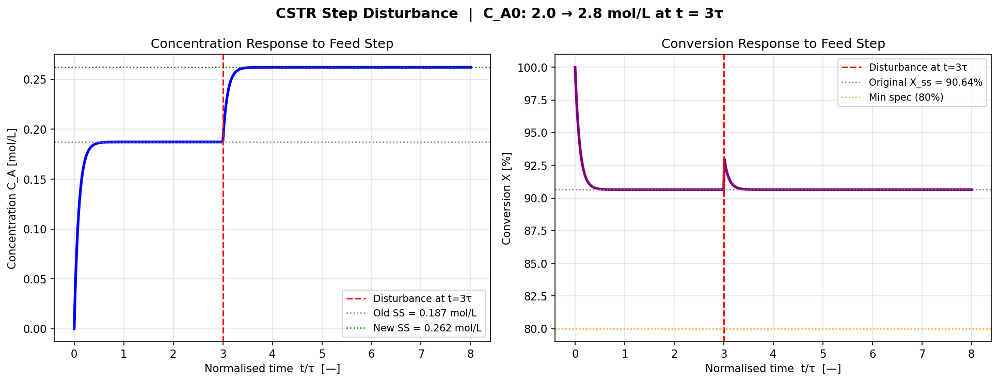
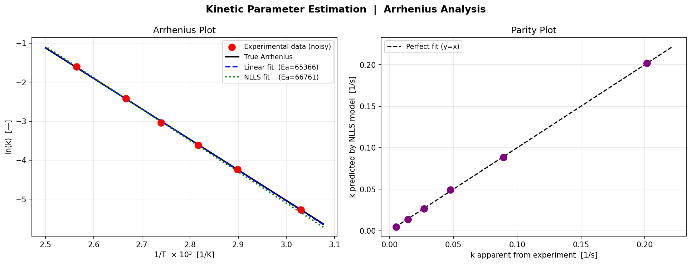

# CSTR-ODE-Parameter-Estimation
# CSTR Dynamic Modelling & Kinetic Parameter Estimation
### Process Systems Engineering | scipy.integrate · scipy.optimize · Arrhenius Analysis

## Overview

This project builds a first-principles dynamic model of a Continuous Stirred Tank
Reactor (CSTR) and solves the **inverse problem**: estimating kinetic parameters
from experimental measurements. It covers four interconnected analyses, progressing
from model construction through dynamic simulation to experimental data fitting.

> **Connection to Project 1:** The steady-state result of this ODE model exactly
> matches the algebraic NLP solution from the CSTR optimisation project — validating
> both approaches from two independent directions.

## Project Structure

| Phase | Analysis | Method |
|---|---|---|
| 1 | Dynamic startup simulation | `scipy.integrate.solve_ivp` (RK45) |
| 2 | Step disturbance response | Two-segment ODE with feed perturbation |
| 3 | Kinetic parameter estimation | Linear Arrhenius + Nonlinear least squares |
| 4 | Model validation | Parity plot + uncertainty quantification |

## Process Model

**Reaction:** A → B (liquid phase, first-order, irreversible)

**CSTR material balance (ODE):**

dC_A/dt  =  (C_A0 − C_A) / τ  −  k(T) · C_A

where  τ  = V / v₀       (residence time)
       k(T) = k₀ · exp(−Eₐ / R·T)    (Arrhenius equation)

**Steady-state solution** (dC_A/dt = 0):

X_ss = Da / (1 + Da)     where Da = k(T) · τ   (Damköhler number)

## Results

### Phase 1 — Dynamic Startup

Starting from an empty reactor (C_A = 0), the ODE solver tracks concentration and
conversion as the reactor approaches steady state. Key findings:

- Reactor reaches ~95% of steady state within **3 residence times** (t/τ ≈ 3)
- ODE steady state: **C_A = 0.1873 mol/L, X = 90.64%**
- Analytical steady state: **C_A = 0.1873 mol/L, X = 90.64%** ✓

The exact match between the dynamic ODE and the algebraic steady-state equation
cross-validates both modelling approaches.

### Phase 2 — Step Disturbance Response

At t = 3τ, the feed concentration is increased from **C_A0 = 2.0 → 2.8 mol/L** (+40%).

| | Before disturbance | After disturbance |
|---|---|---|
| C_A steady state | 0.1873 mol/L | 0.2622 mol/L |
| Conversion X | 90.64% | 90.64% |

**Key engineering insight:** For a first-order CSTR, steady-state conversion is:

X = k·τ / (1 + k·τ)

The feed concentration C_A0 does not appear — conversion depends only on
temperature (through k) and residence time (through τ). A step change in feed
concentration shifts the absolute steady-state C_A but leaves conversion unchanged.
This is a fundamental result in chemical reaction engineering.

### Phase 3 — Kinetic Parameter Estimation

**Experimental setup:** Steady-state C_A measured at 6 reactor temperatures
(330 K → 390 K) with Gaussian measurement noise (σ = 0.005 mol/L).

**Procedure:**
1. Invert CSTR balance to compute apparent k at each temperature: `k = (C_A0/C_A − 1) / τ`
2. Fit Arrhenius model using two methods: linear regression on ln(k) vs 1/T, and nonlinear least squares

**Parameter recovery results:**

| Method | k₀ [1/s] | Eₐ [J/mol] | Eₐ error |
|---|---|---|---|
| True values | 1.000 × 10⁸ | 65,000 | — |
| Linear Arrhenius | 1.126 × 10⁸ | 65,366 | 0.56% |
| Nonlinear (NLLS) | 1.765 × 10⁸ | 66,762 | 2.71% |

**NLLS uncertainty:** Eₐ ± 598 J/mol (0.9% relative uncertainty)

Both methods recover the activation energy within experimental noise. The parity
plot confirms predicted k values fall on the y = x line for all temperatures,
demonstrating good model fit across the full experimental range.

## Engineering Insights

**1. ODE and algebraic models are two views of the same system.**
The dynamic ODE converges to the same steady state as the algebraic CSTR equation.
Building both and confirming agreement is standard validation practice in PSE.

**2. First-order CSTR conversion is independent of feed concentration.**
The Damköhler number Da = k·τ fully determines conversion. Feed disturbances
change the absolute product flow but not the conversion efficiency — only
temperature or residence time changes can shift X.

**3. Six noisy measurements are sufficient to recover kinetic constants.**
NLLS recovered Eₐ within 2.71% from six data points with realistic measurement
noise. This demonstrates how parameter estimation can extract physical constants
from limited experimental data — a key capability in model-based process development.

**4. Linear and nonlinear Arrhenius fitting agree at low noise.**
Both methods give similar Eₐ estimates. At higher noise levels or wider temperature
ranges, NLLS is preferred because it directly minimises the physically relevant
residual (in k-space rather than ln(k)-space).

## Repository Structure

├── Project4_CSTR_ODE_ParameterEstimation.ipynb   # Main Colab notebook
├── cstr_startup.png                               # Dynamic startup plots
├── cstr_disturbance.png                           # Step disturbance response
├── parameter_estimation.png                       # Arrhenius + parity plots
└── README.md

## How to Run

Open the notebook in Google Colab. No special installation needed — all libraries
(scipy, numpy, matplotlib) are pre-installed in Colab.

python
# Required imports only — no solver installation needed
from scipy.integrate import solve_ivp
from scipy.optimize  import curve_fit
import numpy as np
import matplotlib.pyplot as plt

## Tools & Skills Demonstrated

| Category | Tool / Concept |
|---|---|
| ODE solving | `scipy.integrate.solve_ivp` (RK45 adaptive step) |
| Parameter estimation | `scipy.optimize.curve_fit` (NLLS) |
| Linear regression | `numpy.polyfit` (Arrhenius linearisation) |
| Process modelling | CSTR material balance, Arrhenius kinetics, Damköhler number |
| PSE concepts | Dynamic simulation, step response, inverse problem, parity plot |
| Uncertainty analysis | Covariance matrix → parameter confidence intervals |
| Visualisation | Matplotlib (startup curves, disturbance response, Arrhenius plot, parity plot) |

## Background

Developed as part of an M.Sc. in Chemical and Energy Engineering
(Process Systems Engineering) at Otto-von-Guericke-Universität Magdeburg.

Demonstrates first-principles dynamic process modelling and experimental
data-driven parameter estimation — core methods in PSE research and
model-based process development.

